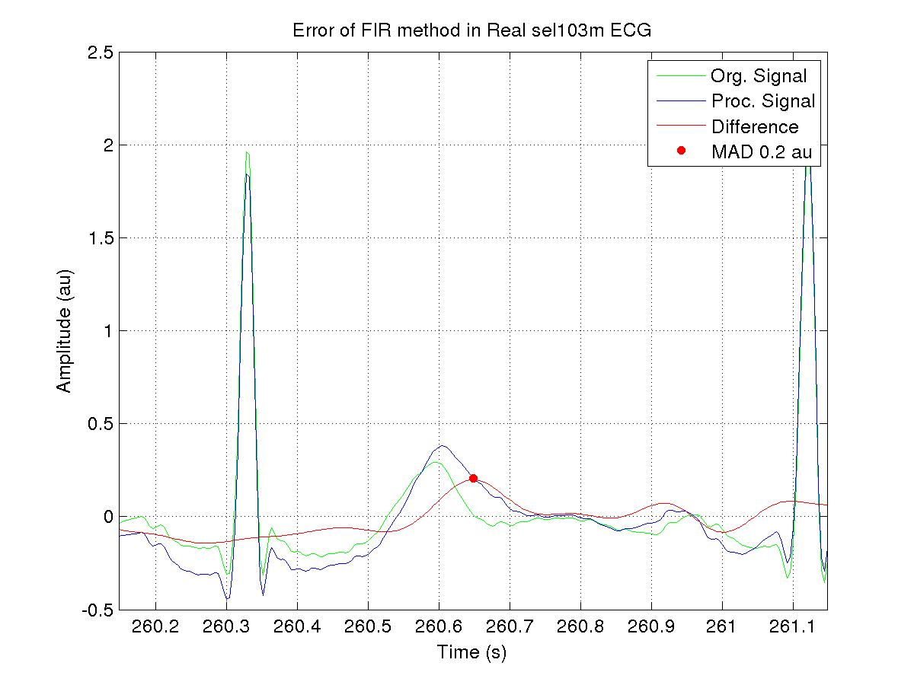
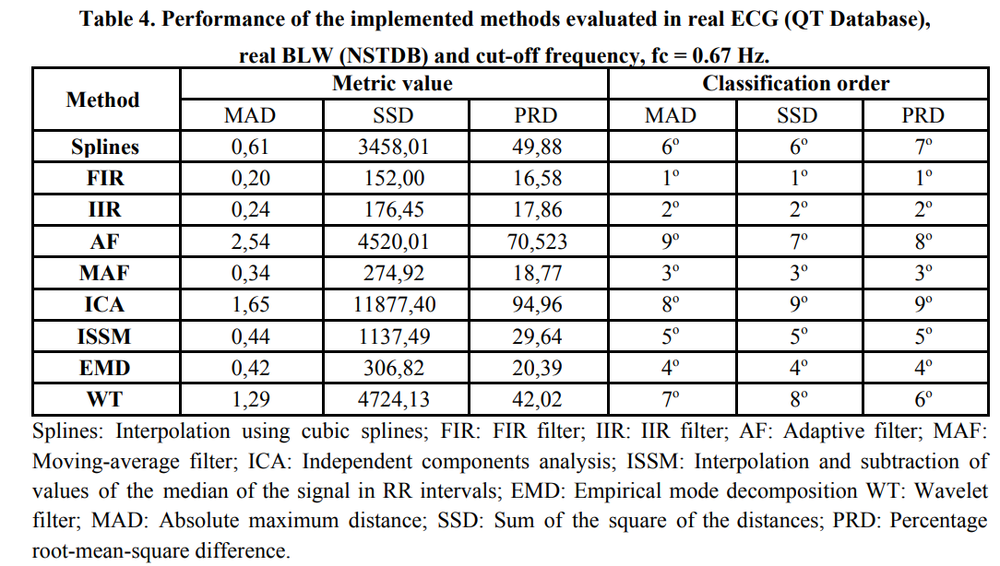

# BaseLineWander Removal Methods

A follow-up and more recent work from our team in Baseline Wander Removal for ECG signals using Deep Learning and Python can be found in:

Codes: https://github.com/fperdigon/DeepFilter

Paper: https://www.sciencedirect.com/science/article/abs/pii/S1746809421005899

This repository contains the implementation of several baseline wander removals methods for ECG signals. Also contains the implementation of similarity metrics and some utils funtions for ECG precessing. For more information please check our paper https://arxiv.org/pdf/1807.11359.pdf

**This repository was implemented in MATLAB 2014a and it may not work with newer Matlab versions. No further maintenance will be given**

All these methods were programmed according the literature information.
The reference to these papers appear in the header information of each method.

## Files description:

BLremover.m (9 methods for Base Line Wander removal)
- Based on Cubic SPlines
- Based on FIR filters
- Based on IRR filters
- Based on LMS adaptive filters
- Based on moving-average filter
- Based on Independent Components Analysis (ICA)
- Based on Interpolation and Successive Subtraction of Median Values (ISSM)
- Based on Empirical Mode Decomposition (EMD)
- Based on Wavelet Transform

SimMetricsECG.m (3 similarity metrics)
- Maximum Absolute Distance Metric (MAD)
- Sum Square Distance Metric (SSD)
- Percentage Root-Mean-Square Difference Metric (PRD)

utilECG.m (Several ECG tools)
- Methods to detect R peaks
- Methods to detect PQ intervals
- Methods for filtering the ECG signal
- Methods to add artificial noise (BLW, power line)

## Results
The following table present the quantitative results.

## References

- F. P. Romero, L. V. Romaguera, C. R. Vázquez-Seisdedos, C. F. F. C. Filho, M. G. F. Costa, and J. E. Neto, “Baseline wander removal methods for ECG signals: A comparative study,” Jul. 2018.

## Citing this work

When citing this work please use this BibTeX entry:

    @article{Romero2018,
    title = {{Baseline wander removal methods for ECG signals: A comparative study}},
    archivePrefix = {arXiv},
    arxivId = {1807.11359},
    author = {Romero, Francisco Perdig{\'{o}}n and Romaguera, Liset V{\'{a}}zquez and V{\'{a}}zquez-Seisdedos, Carlos Rom{\'{a}}n and Filho, C{\'{i}}cero Ferreira Fernandes Costa and Costa, Marly Guimar{\~{a}}es Fernandes and Neto, Jo{\~{a}}o Evangelista},
    eprint = {1807.11359},
    month = {jul},
    url = {http://arxiv.org/abs/1807.11359},
    year = {2018}
    }

## License 

The MIT License (MIT)

Copyright (c) 2018 Francisco Perdigon Romero

Permission is hereby granted, free of charge, to any person obtaining a copy of this software and associated documentation files (the "Software"), to deal in the Software without restriction, including without limitation the rights to use, copy, modify, merge, publish, distribute, sublicense, and/or sell copies of the Software, and to permit persons to whom the Software is furnished to do so, subject to the following conditions:

The above copyright notice and this permission notice shall be included in all copies or substantial portions of the Software.

THE SOFTWARE IS PROVIDED "AS IS", WITHOUT WARRANTY OF ANY KIND, EXPRESS OR IMPLIED, INCLUDING BUT NOT LIMITED TO THE WARRANTIES OF MERCHANTABILITY, FITNESS FOR A PARTICULAR PURPOSE AND NONINFRINGEMENT. IN NO EVENT SHALL THE AUTHORS OR COPYRIGHT HOLDERS BE LIABLE FOR ANY CLAIM, DAMAGES OR OTHER LIABILITY, WHETHER IN AN ACTION OF CONTRACT, TORT OR OTHERWISE, ARISING FROM, OUT OF OR IN CONNECTION WITH THE SOFTWARE OR THE USE OR OTHER DEALINGS IN THE SOFTWARE.
